# Study Agent — Sequence Diagrams

Mermaid syntax: use `participant Alias as Display Name` for all services (no spaces in aliases).

---

## 1. Quiz generation

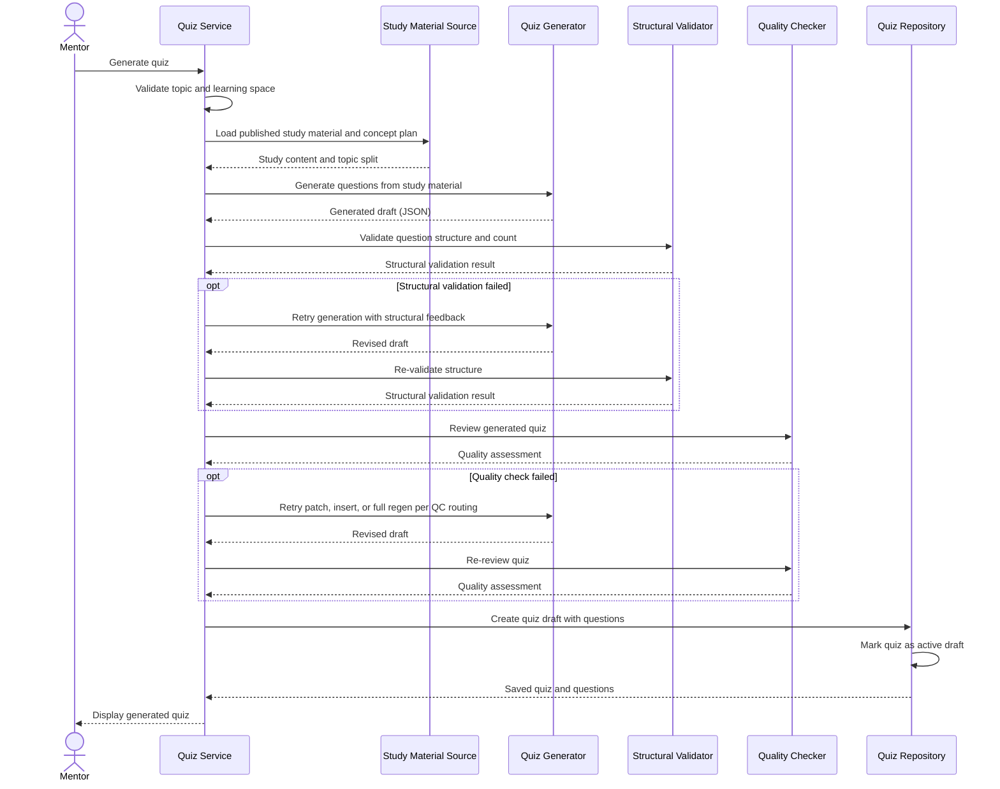
```mermaid
sequenceDiagram
    actor Mentor
    participant QuizService as Quiz Service
    participant StudyMaterialSource as Study Material Source
    participant QuizGenerator as Quiz Generator
    participant StructuralValidator as Structural Validator
    participant QualityChecker as Quality Checker
    participant QuizRepository as Quiz Repository

    Mentor->>QuizService: Generate quiz
    QuizService->>QuizService: Validate topic and learning space

    QuizService->>StudyMaterialSource: Load published study material and concept plan
    StudyMaterialSource-->>QuizService: Study content and topic split

    QuizService->>QuizGenerator: Generate questions from study material
    QuizGenerator-->>QuizService: Generated draft (JSON)

    QuizService->>StructuralValidator: Validate question structure and count
    StructuralValidator-->>QuizService: Structural validation result

    opt Structural validation failed
        QuizService->>QuizGenerator: Retry generation with structural feedback
        QuizGenerator-->>QuizService: Revised draft
        QuizService->>StructuralValidator: Re-validate structure
        StructuralValidator-->>QuizService: Structural validation result
    end

    QuizService->>QualityChecker: Review generated quiz
    QualityChecker-->>QuizService: Quality assessment

    opt Quality check failed
        QuizService->>QuizGenerator: Retry patch, insert, or full regen per QC routing
        QuizGenerator-->>QuizService: Revised draft
        QuizService->>QualityChecker: Re-review quiz
        QualityChecker-->>QuizService: Quality assessment
    end

    QuizService->>QuizRepository: Create quiz draft with questions
    QuizRepository->>QuizRepository: Mark quiz as active draft
    QuizRepository-->>QuizService: Saved quiz and questions

    QuizService-->>Mentor: Display generated quiz
```

---

## 2. Hint generation

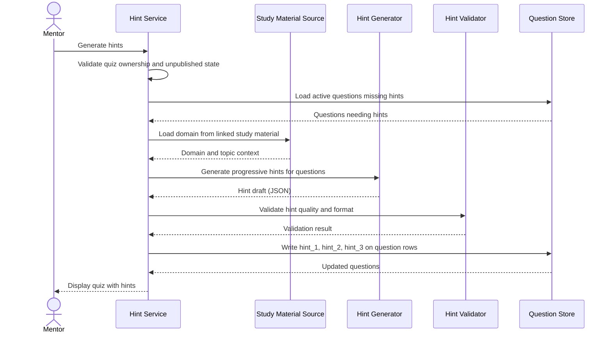
```mermaid
sequenceDiagram
    actor Mentor
    participant HintService as Hint Service
    participant StudyMaterialSource as Study Material Source
    participant HintGenerator as Hint Generator
    participant HintValidator as Hint Validator
    participant QuestionStore as Question Store

    Mentor->>HintService: Generate hints
    HintService->>HintService: Validate quiz ownership and unpublished state

    HintService->>QuestionStore: Load active questions missing hints
    QuestionStore-->>HintService: Questions needing hints

    HintService->>StudyMaterialSource: Load domain from linked study material
    StudyMaterialSource-->>HintService: Domain and topic context

    HintService->>HintGenerator: Generate progressive hints for questions
    HintGenerator-->>HintService: Hint draft (JSON)

    HintService->>HintValidator: Validate hint quality and format
    HintValidator-->>HintService: Validation result

    HintService->>QuestionStore: Write hint_1, hint_2, hint_3 on question rows
    QuestionStore-->>HintService: Updated questions

    HintService-->>Mentor: Display quiz with hints
```

---

## 3. Quiz regeneration (full quiz + single or multiple questions)

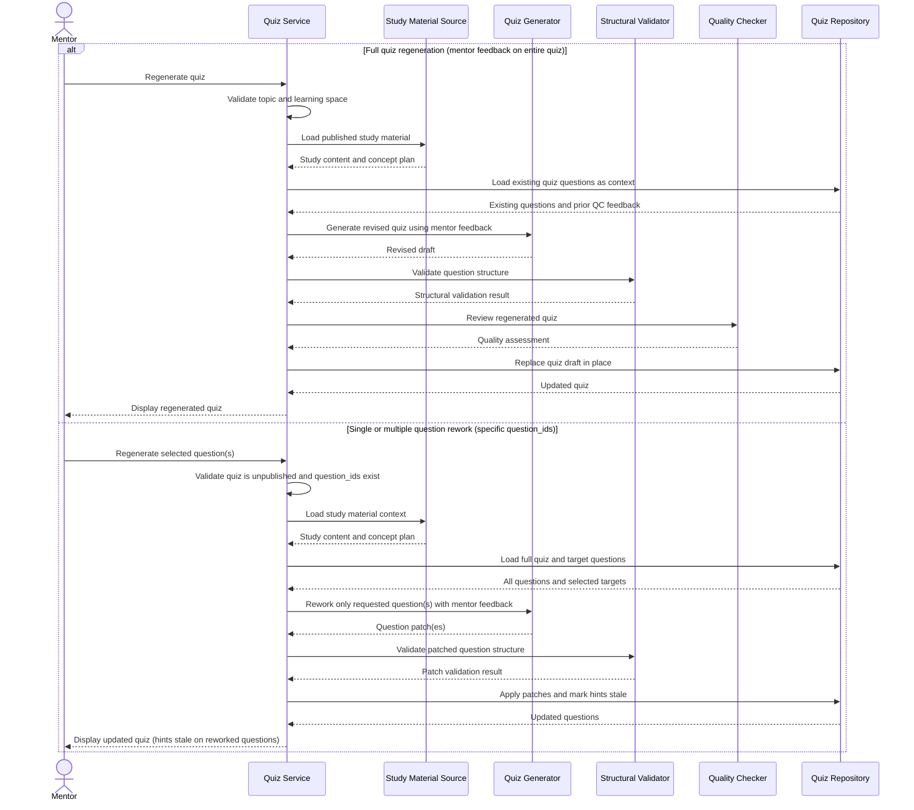
```mermaid
sequenceDiagram
    actor Mentor
    participant QuizService as Quiz Service
    participant StudyMaterialSource as Study Material Source
    participant QuizGenerator as Quiz Generator
    participant StructuralValidator as Structural Validator
    participant QualityChecker as Quality Checker
    participant QuizRepository as Quiz Repository

    alt Full quiz regeneration (mentor feedback on entire quiz)
        Mentor->>QuizService: Regenerate quiz
        QuizService->>QuizService: Validate topic and learning space

        QuizService->>StudyMaterialSource: Load published study material
        StudyMaterialSource-->>QuizService: Study content and concept plan

        QuizService->>QuizRepository: Load existing quiz questions as context
        QuizRepository-->>QuizService: Existing questions and prior QC feedback

        QuizService->>QuizGenerator: Generate revised quiz using mentor feedback
        QuizGenerator-->>QuizService: Revised draft

        QuizService->>StructuralValidator: Validate question structure
        StructuralValidator-->>QuizService: Structural validation result

        QuizService->>QualityChecker: Review regenerated quiz
        QualityChecker-->>QuizService: Quality assessment

        QuizService->>QuizRepository: Replace quiz draft in place
        QuizRepository-->>QuizService: Updated quiz

        QuizService-->>Mentor: Display regenerated quiz

    else Single or multiple question rework (specific question_ids)
        Mentor->>QuizService: Regenerate selected question(s)
        QuizService->>QuizService: Validate quiz is unpublished and question_ids exist

        QuizService->>StudyMaterialSource: Load study material context
        StudyMaterialSource-->>QuizService: Study content and concept plan

        QuizService->>QuizRepository: Load full quiz and target questions
        QuizRepository-->>QuizService: All questions and selected targets

        QuizService->>QuizGenerator: Rework only requested question(s) with mentor feedback
        QuizGenerator-->>QuizService: Question patch(es)

        QuizService->>StructuralValidator: Validate patched question structure
        StructuralValidator-->>QuizService: Patch validation result

        QuizService->>QuizRepository: Apply patches and mark hints stale
        QuizRepository-->>QuizService: Updated questions

        QuizService-->>Mentor: Display updated quiz (hints stale on reworked questions)
    end
```

---

## 4. Hint regeneration (all questions + selective)

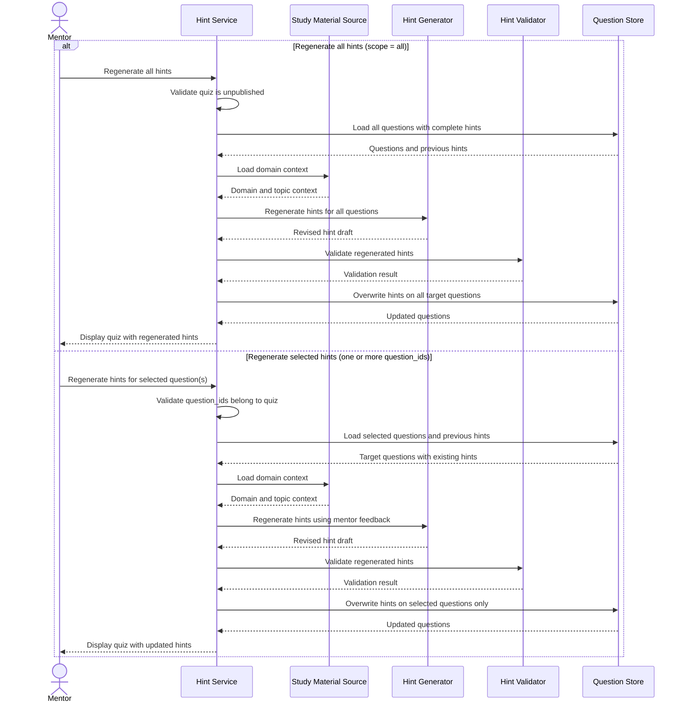
```mermaid
sequenceDiagram
    actor Mentor
    participant HintService as Hint Service
    participant StudyMaterialSource as Study Material Source
    participant HintGenerator as Hint Generator
    participant HintValidator as Hint Validator
    participant QuestionStore as Question Store

    alt Regenerate all hints (scope = all)
        Mentor->>HintService: Regenerate all hints
        HintService->>HintService: Validate quiz is unpublished

        HintService->>QuestionStore: Load all questions with complete hints
        QuestionStore-->>HintService: Questions and previous hints

        HintService->>StudyMaterialSource: Load domain context
        StudyMaterialSource-->>HintService: Domain and topic context

        HintService->>HintGenerator: Regenerate hints for all questions
        HintGenerator-->>HintService: Revised hint draft

        HintService->>HintValidator: Validate regenerated hints
        HintValidator-->>HintService: Validation result

        HintService->>QuestionStore: Overwrite hints on all target questions
        QuestionStore-->>HintService: Updated questions

        HintService-->>Mentor: Display quiz with regenerated hints

    else Regenerate selected hints (one or more question_ids)
        Mentor->>HintService: Regenerate hints for selected question(s)
        HintService->>HintService: Validate question_ids belong to quiz

        HintService->>QuestionStore: Load selected questions and previous hints
        QuestionStore-->>HintService: Target questions with existing hints

        HintService->>StudyMaterialSource: Load domain context
        StudyMaterialSource-->>HintService: Domain and topic context

        HintService->>HintGenerator: Regenerate hints using mentor feedback
        HintGenerator-->>HintService: Revised hint draft

        HintService->>HintValidator: Validate regenerated hints
        HintValidator-->>HintService: Validation result

        HintService->>QuestionStore: Overwrite hints on selected questions only
        QuestionStore-->>HintService: Updated questions

        HintService-->>Mentor: Display quiz with updated hints
    end
```

---

## 5. QC — Study material

### 5a. Full QC (initial pass)

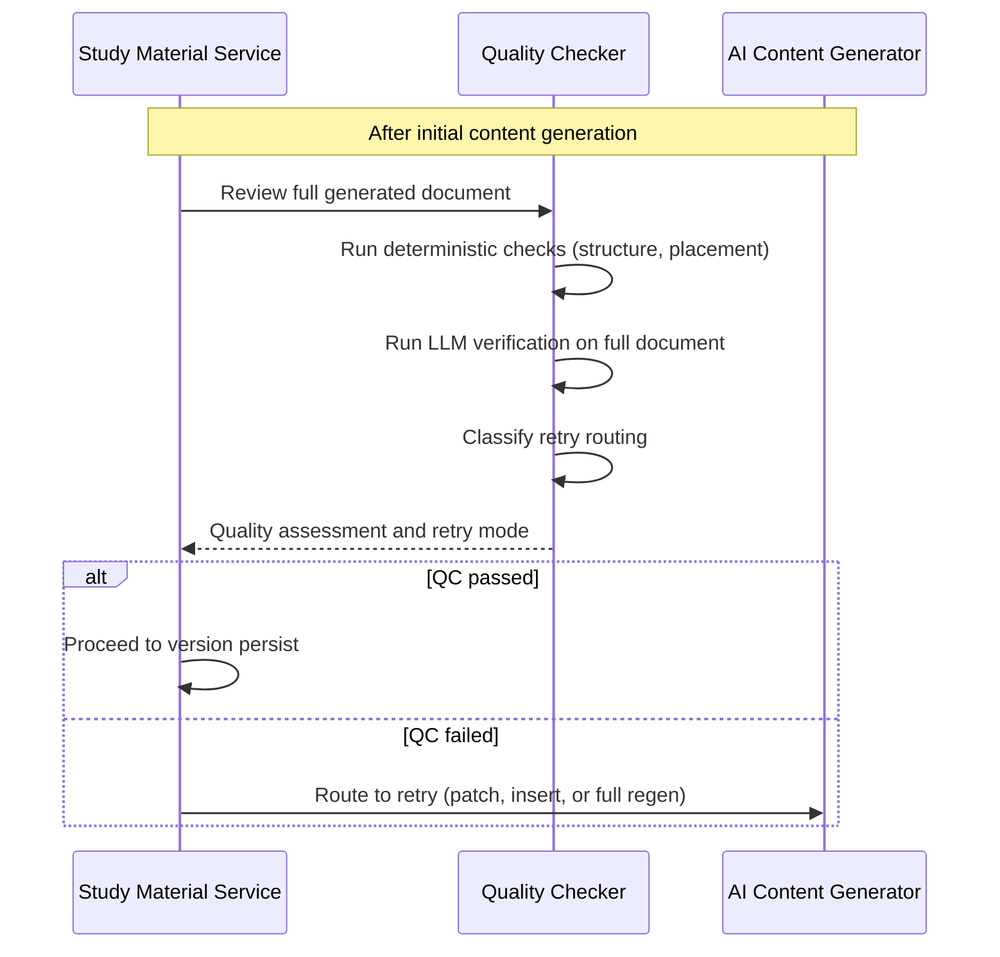
```mermaid
sequenceDiagram
    participant StudyMaterialService as Study Material Service
    participant QualityChecker as Quality Checker
    participant AIContentGenerator as AI Content Generator

    Note over StudyMaterialService,AIContentGenerator: After initial content generation

    StudyMaterialService->>QualityChecker: Review full generated document
    QualityChecker->>QualityChecker: Run deterministic checks (structure, placement)
    QualityChecker->>QualityChecker: Run LLM verification on full document
    QualityChecker->>QualityChecker: Classify retry routing
    QualityChecker-->>StudyMaterialService: Quality assessment and retry mode

    alt QC passed
        StudyMaterialService->>StudyMaterialService: Proceed to version persist
    else QC failed
        StudyMaterialService->>AIContentGenerator: Route to retry (patch, insert, or full regen)
    end
```

### 5b. Section patch retry

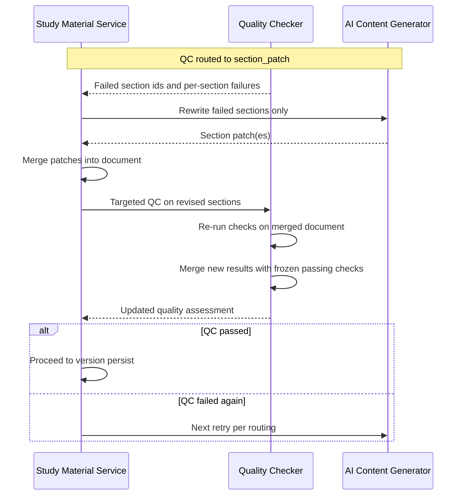
```mermaid
sequenceDiagram
    participant StudyMaterialService as Study Material Service
    participant QualityChecker as Quality Checker
    participant AIContentGenerator as AI Content Generator

    Note over StudyMaterialService,AIContentGenerator: QC routed to section_patch

    QualityChecker-->>StudyMaterialService: Failed section ids and per-section failures

    StudyMaterialService->>AIContentGenerator: Rewrite failed sections only
    AIContentGenerator-->>StudyMaterialService: Section patch(es)

    StudyMaterialService->>StudyMaterialService: Merge patches into document

    StudyMaterialService->>QualityChecker: Targeted QC on revised sections
    QualityChecker->>QualityChecker: Re-run checks on merged document
    QualityChecker->>QualityChecker: Merge new results with frozen passing checks
    QualityChecker-->>StudyMaterialService: Updated quality assessment

    alt QC passed
        StudyMaterialService->>StudyMaterialService: Proceed to version persist
    else QC failed again
        StudyMaterialService->>AIContentGenerator: Next retry per routing
    end
```

### 5c. Section insert retry

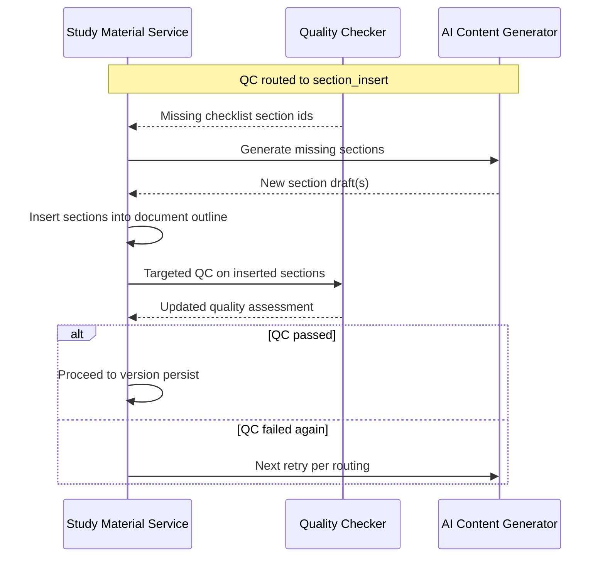
```mermaid
sequenceDiagram
    participant StudyMaterialService as Study Material Service
    participant QualityChecker as Quality Checker
    participant AIContentGenerator as AI Content Generator

    Note over StudyMaterialService,AIContentGenerator: QC routed to section_insert

    QualityChecker-->>StudyMaterialService: Missing checklist section ids

    StudyMaterialService->>AIContentGenerator: Generate missing sections
    AIContentGenerator-->>StudyMaterialService: New section draft(s)

    StudyMaterialService->>StudyMaterialService: Insert sections into document outline

    StudyMaterialService->>QualityChecker: Targeted QC on inserted sections
    QualityChecker-->>StudyMaterialService: Updated quality assessment

    alt QC passed
        StudyMaterialService->>StudyMaterialService: Proceed to version persist
    else QC failed again
        StudyMaterialService->>AIContentGenerator: Next retry per routing
    end
```

### 5d. Full regeneration retry

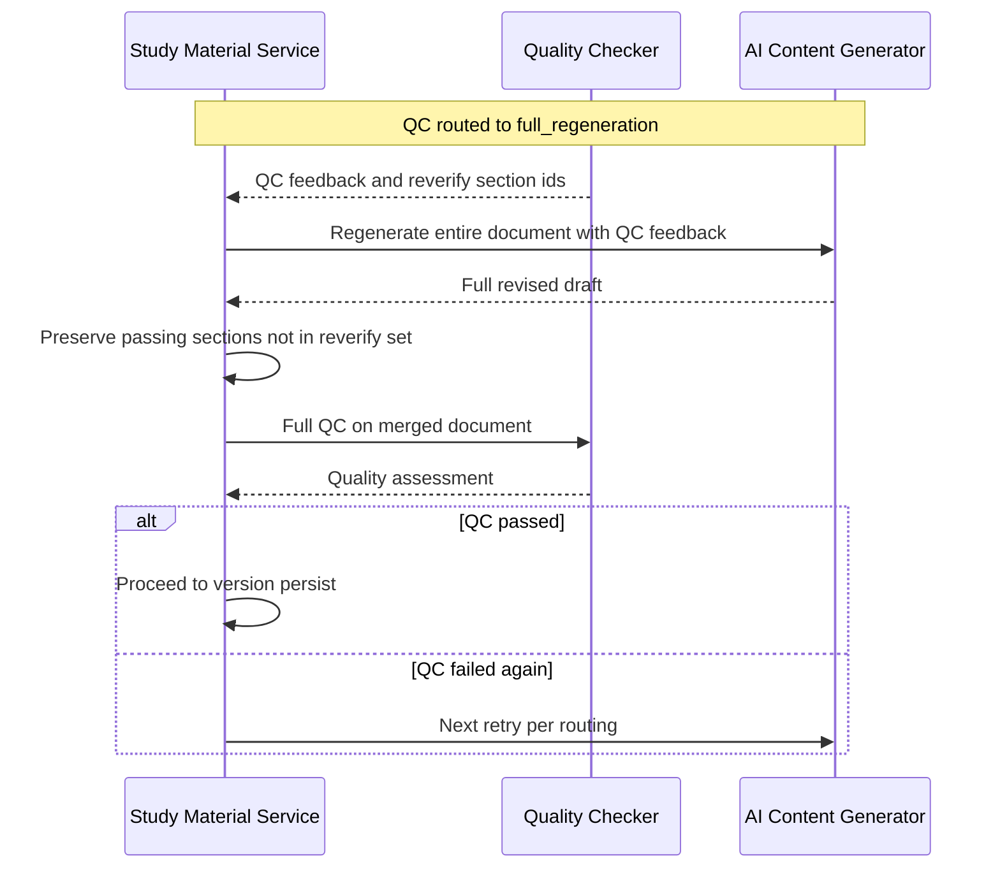
```mermaid
sequenceDiagram
    participant StudyMaterialService as Study Material Service
    participant QualityChecker as Quality Checker
    participant AIContentGenerator as AI Content Generator

    Note over StudyMaterialService,AIContentGenerator: QC routed to full_regeneration

    QualityChecker-->>StudyMaterialService: QC feedback and reverify section ids

    StudyMaterialService->>AIContentGenerator: Regenerate entire document with QC feedback
    AIContentGenerator-->>StudyMaterialService: Full revised draft

    StudyMaterialService->>StudyMaterialService: Preserve passing sections not in reverify set

    StudyMaterialService->>QualityChecker: Full QC on merged document
    QualityChecker-->>StudyMaterialService: Quality assessment

    alt QC passed
        StudyMaterialService->>StudyMaterialService: Proceed to version persist
    else QC failed again
        StudyMaterialService->>AIContentGenerator: Next retry per routing
    end
```

---

## 6. QC — Quiz

### 6a. Full quiz QC (initial pass)

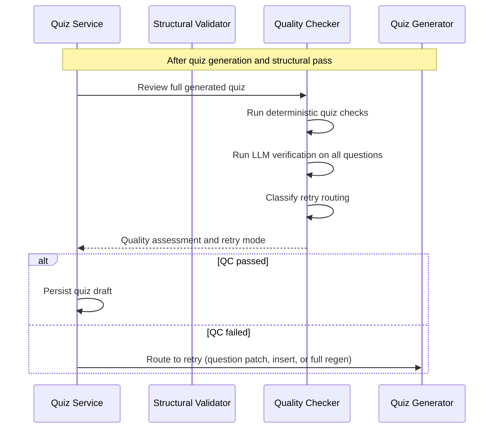
```mermaid
sequenceDiagram
    participant QuizService as Quiz Service
    participant StructuralValidator as Structural Validator
    participant QualityChecker as Quality Checker
    participant QuizGenerator as Quiz Generator

    Note over QuizService,QuizGenerator: After quiz generation and structural pass

    QuizService->>QualityChecker: Review full generated quiz
    QualityChecker->>QualityChecker: Run deterministic quiz checks
    QualityChecker->>QualityChecker: Run LLM verification on all questions
    QualityChecker->>QualityChecker: Classify retry routing
    QualityChecker-->>QuizService: Quality assessment and retry mode

    alt QC passed
        QuizService->>QuizService: Persist quiz draft
    else QC failed
        QuizService->>QuizGenerator: Route to retry (question patch, insert, or full regen)
    end
```

### 6b. Question patch retry

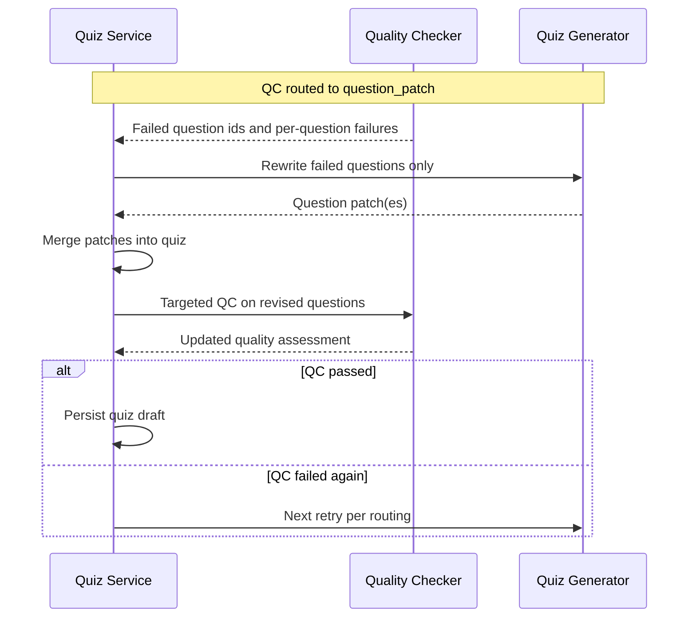
```mermaid
sequenceDiagram
    participant QuizService as Quiz Service
    participant QualityChecker as Quality Checker
    participant QuizGenerator as Quiz Generator

    Note over QuizService,QuizGenerator: QC routed to question_patch

    QualityChecker-->>QuizService: Failed question ids and per-question failures

    QuizService->>QuizGenerator: Rewrite failed questions only
    QuizGenerator-->>QuizService: Question patch(es)

    QuizService->>QuizService: Merge patches into quiz

    QuizService->>QualityChecker: Targeted QC on revised questions
    QualityChecker-->>QuizService: Updated quality assessment

    alt QC passed
        QuizService->>QuizService: Persist quiz draft
    else QC failed again
        QuizService->>QuizGenerator: Next retry per routing
    end
```

### 6c. Question insert retry

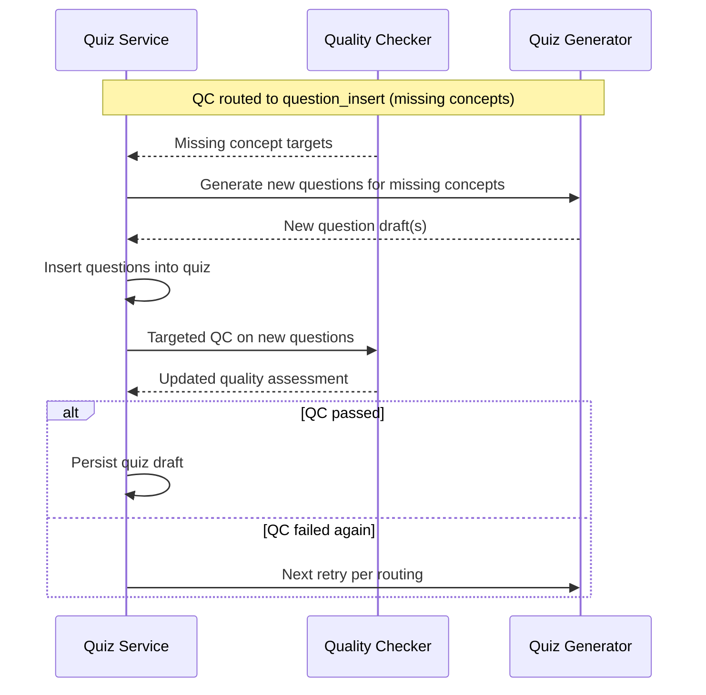
```mermaid
sequenceDiagram
    participant QuizService as Quiz Service
    participant QualityChecker as Quality Checker
    participant QuizGenerator as Quiz Generator

    Note over QuizService,QuizGenerator: QC routed to question_insert (missing concepts)

    QualityChecker-->>QuizService: Missing concept targets

    QuizService->>QuizGenerator: Generate new questions for missing concepts
    QuizGenerator-->>QuizService: New question draft(s)

    QuizService->>QuizService: Insert questions into quiz

    QuizService->>QualityChecker: Targeted QC on new questions
    QualityChecker-->>QuizService: Updated quality assessment

    alt QC passed
        QuizService->>QuizService: Persist quiz draft
    else QC failed again
        QuizService->>QuizGenerator: Next retry per routing
    end
```

### 6d. Full quiz regeneration retry

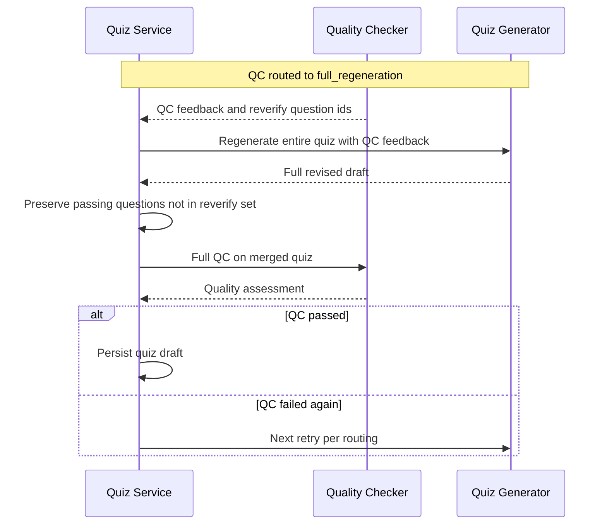
```mermaid
sequenceDiagram
    participant QuizService as Quiz Service
    participant QualityChecker as Quality Checker
    participant QuizGenerator as Quiz Generator

    Note over QuizService,QuizGenerator: QC routed to full_regeneration

    QualityChecker-->>QuizService: QC feedback and reverify question ids

    QuizService->>QuizGenerator: Regenerate entire quiz with QC feedback
    QuizGenerator-->>QuizService: Full revised draft

    QuizService->>QuizService: Preserve passing questions not in reverify set

    QuizService->>QualityChecker: Full QC on merged quiz
    QualityChecker-->>QuizService: Quality assessment

    alt QC passed
        QuizService->>QuizService: Persist quiz draft
    else QC failed again
        QuizService->>QuizGenerator: Next retry per routing
    end
```

---

## 7. Study material — Generate (reference)

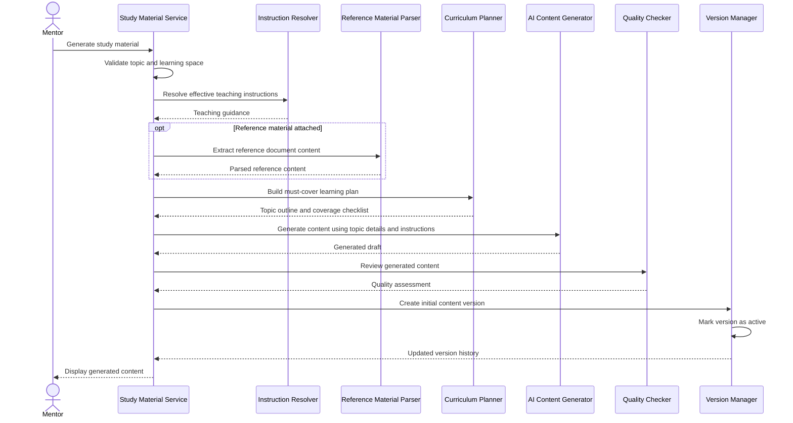
```mermaid
sequenceDiagram
    actor Mentor
    participant StudyMaterialService as Study Material Service
    participant InstructionResolver as Instruction Resolver
    participant ReferenceMaterialParser as Reference Material Parser
    participant CurriculumPlanner as Curriculum Planner
    participant AIContentGenerator as AI Content Generator
    participant QualityChecker as Quality Checker
    participant VersionManager as Version Manager

    Mentor->>StudyMaterialService: Generate study material
    StudyMaterialService->>StudyMaterialService: Validate topic and learning space

    StudyMaterialService->>InstructionResolver: Resolve effective teaching instructions
    InstructionResolver-->>StudyMaterialService: Teaching guidance

    opt Reference material attached
        StudyMaterialService->>ReferenceMaterialParser: Extract reference document content
        ReferenceMaterialParser-->>StudyMaterialService: Parsed reference content
    end

    StudyMaterialService->>CurriculumPlanner: Build must-cover learning plan
    CurriculumPlanner-->>StudyMaterialService: Topic outline and coverage checklist

    StudyMaterialService->>AIContentGenerator: Generate content using topic details and instructions
    AIContentGenerator-->>StudyMaterialService: Generated draft

    StudyMaterialService->>QualityChecker: Review generated content
    QualityChecker-->>StudyMaterialService: Quality assessment

    StudyMaterialService->>VersionManager: Create initial content version
    VersionManager->>VersionManager: Mark version as active
    VersionManager-->>StudyMaterialService: Updated version history

    StudyMaterialService-->>Mentor: Display generated content
```

---

## 8. Study material — Regenerate (reference)

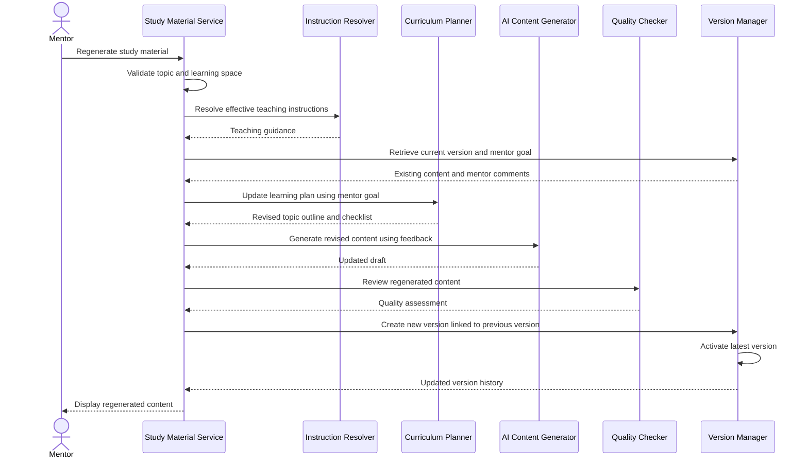
```mermaid
sequenceDiagram
    actor Mentor
    participant StudyMaterialService as Study Material Service
    participant InstructionResolver as Instruction Resolver
    participant CurriculumPlanner as Curriculum Planner
    participant AIContentGenerator as AI Content Generator
    participant QualityChecker as Quality Checker
    participant VersionManager as Version Manager

    Mentor->>StudyMaterialService: Regenerate study material
    StudyMaterialService->>StudyMaterialService: Validate topic and learning space

    StudyMaterialService->>InstructionResolver: Resolve effective teaching instructions
    InstructionResolver-->>StudyMaterialService: Teaching guidance

    StudyMaterialService->>VersionManager: Retrieve current version and mentor goal
    VersionManager-->>StudyMaterialService: Existing content and mentor comments

    StudyMaterialService->>CurriculumPlanner: Update learning plan using mentor goal
    CurriculumPlanner-->>StudyMaterialService: Revised topic outline and checklist

    StudyMaterialService->>AIContentGenerator: Generate revised content using feedback
    AIContentGenerator-->>StudyMaterialService: Updated draft

    StudyMaterialService->>QualityChecker: Review regenerated content
    QualityChecker-->>StudyMaterialService: Quality assessment

    StudyMaterialService->>VersionManager: Create new version linked to previous version
    VersionManager->>VersionManager: Activate latest version
    VersionManager-->>StudyMaterialService: Updated version history

    StudyMaterialService-->>Mentor: Display regenerated content
```

---

## 9. Study material — Improve and manual edit (reference)

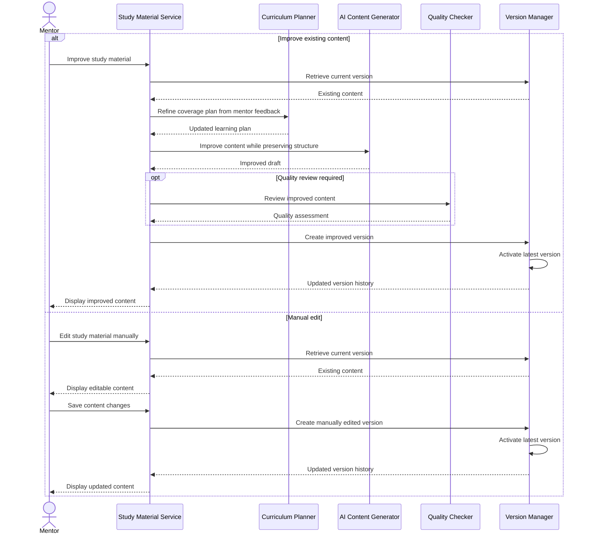
```mermaid
sequenceDiagram
    actor Mentor
    participant StudyMaterialService as Study Material Service
    participant CurriculumPlanner as Curriculum Planner
    participant AIContentGenerator as AI Content Generator
    participant QualityChecker as Quality Checker
    participant VersionManager as Version Manager

    alt Improve existing content
        Mentor->>StudyMaterialService: Improve study material
        StudyMaterialService->>VersionManager: Retrieve current version
        VersionManager-->>StudyMaterialService: Existing content

        StudyMaterialService->>CurriculumPlanner: Refine coverage plan from mentor feedback
        CurriculumPlanner-->>StudyMaterialService: Updated learning plan

        StudyMaterialService->>AIContentGenerator: Improve content while preserving structure
        AIContentGenerator-->>StudyMaterialService: Improved draft

        opt Quality review required
            StudyMaterialService->>QualityChecker: Review improved content
            QualityChecker-->>StudyMaterialService: Quality assessment
        end

        StudyMaterialService->>VersionManager: Create improved version
        VersionManager->>VersionManager: Activate latest version
        VersionManager-->>StudyMaterialService: Updated version history

        StudyMaterialService-->>Mentor: Display improved content

    else Manual edit
        Mentor->>StudyMaterialService: Edit study material manually
        StudyMaterialService->>VersionManager: Retrieve current version
        VersionManager-->>StudyMaterialService: Existing content

        StudyMaterialService-->>Mentor: Display editable content
        Mentor->>StudyMaterialService: Save content changes

        StudyMaterialService->>VersionManager: Create manually edited version
        VersionManager->>VersionManager: Activate latest version
        VersionManager-->>StudyMaterialService: Updated version history

        StudyMaterialService-->>Mentor: Display updated content
    end
```
